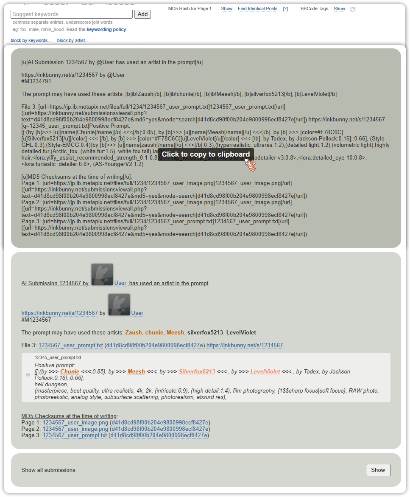

<p align="center">
  
  
  <br>
  <h1 align="center">Inkbunny Auditor</h1>
</p>

<p align="center">
  <a href="https://inkbunny.net/">
    
  </a>
  <a href="https://wiki.inkbunny.net/wiki/API">
    
  </a>
  <a href="https://pkg.go.dev/github.com/ellypaws/inkbunny/api">
    
  </a>
  <a href="https://github.com/ellypaws/inkbunny">
    
  </a>
  <a href="https://goreportcard.com/report/github.com/ellypaws/inkbunny-app">
    
  </a>
  <br>
  <a href="https://github.com/ellypaws/inkbunny-app/graphs/contributors">
    
  </a>
  <a href="https://github.com/ellypaws/inkbunny-app/commits/main">
    
  </a>
  <a href="https://github.com/ellypaws/inkbunny-app">
    
  </a>
</p>

--------------

<p align="right"><i>Disclaimer: This project is not affiliated or endorsed by Inkbunny.</i></p>


This project is designed to detect AI-generated images made with stable diffusion in Inkbunny submissions. It processes
the descriptions of submissions and extracts prompt details through a Language Learning Model (LLM). The processed data
is then structured into a text-to-image format.

By using crafted [heuristics](https://github.com/ellypaws/inkbunny-sd),
as well as the potential to use an LLM to inference the parameters.
A general purpose [API](cmd/api) library is available to integrate with your own program logic.

There are three different projects that aim to help in auditing and moderating AI generated content.

## [Inkbunny ML](cmd/server): A General-Purpose [API](cmd/api)
Inkbunny ML offers a comprehensive suite of tools designed for auditing and moderating AI-generated content. It includes an extensive database that manages everything from tickets and auditors to artist lookups and the auditing process itself.

To boost performance, this module integrates a dual-layer caching system, utilizing both local and Redis caches. This strategy is crafted to deliver aggressive performance improvements and scalable results.


<details>
<summary>It can also pre-write a ticket</summary>
The system simplifies your workflow by automatically generating a prepared ticket based on smart heuristics. This allows you to focus on the essential tasks of auditing and modifying the ticket before submission to Inkbunny.


</details>

## [Inkbunny AI Bridge](cmd/extension): A [Userscript](https://github.com/ellypaws/inkbunny-extension/tree/main/scripts) Server
The Inkbunny AI Bridge extends the functionality of your browser through a userscript that creates a ticket ready for your review. Based on advanced heuristics, the script prepares everything you need to ensure the content meets Inkbunny's standards.

It displays a badge on each submission to quickly notify you of any potential flagged submission worth verifying.


<details>
<summary>It constructs a prepared ticket based on the heuristics for you to audit and modify to then submit to Inkbunny.</summary>


</details>

#### [CLI](cmd/cli): Command Line Interface
For those who prefer the directness of a command line, the CLI offers a robust interface for engaging with the Inkbunny ML API. It's an effective alternative to the web interface, providing all the necessary commands at your fingertips.


## Usage

> [!IMPORTANT]  
> Make sure you have API turned on in your Inkbunny account settings. You will need your API key and SID to use the Inkbunny API. You can change this in your [account settings](https://inkbunny.net/account.php#:~:text=API%20(External%20Scripting)).

You can read the individual readme files for each project to get started.
An example usage for [Inkbunny AI Bridge](cmd/extension) is provided below.

Set the environment variables for the server to run. You can set the following environment variables:

```bash
export PORT "your_port" # default is 1323
export API_HOST "your_api_host"
export SD_HOST "your_sd_host" # default is "http://localhost:7860"
export REDIS_HOST "your_redis_host" # default is "localhost:6379", when not set, uses local memory cache
export REDIS_PASSWORD "your_redis_password"
export REDIS_USER "your_redis_user" # when not set, uses 'default'
```

An optional Redis server can be used for caching.
If not set, it will fall back to local memory cache.
You can always override this behavior for most request by setting the `Cache-Control` header to `no-cache`.

### Building from Source

If you're building from source, you will need to install the dependencies:
Download Go 1.22.3 or later from the [official website](https://golang.org/dl/).

> When cloning from the repository, make sure to use `--recurse-submodules` to initialize inkbunny-sd.

```bash
git clone --recurse-submodules https://github.com/ellypaws/inkbunny-app.git
cd inkbunny-app/cmd/extension
git submodule update --init --recursive

go build -o inkbunny-ai-bridge
./inkbunny-ai-bridge
```

And when pulling, make sure to update the submodules:

```bash
git pull --recurse-submodules

# or if you forgot to clone with submodules
git pull
git submodule update --init --recursive
```

You can also use the pre-built binaries from the [releases page](https://github.com/ellypaws/inkbunny-app/releases).

> [!NOTE]  
> Disclaimer: This project is not affiliated or endorsed by Inkbunny.