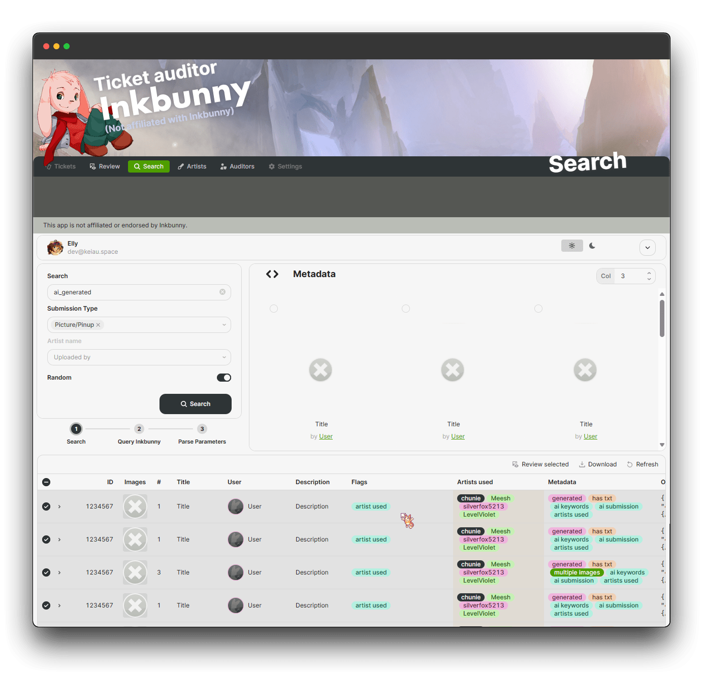
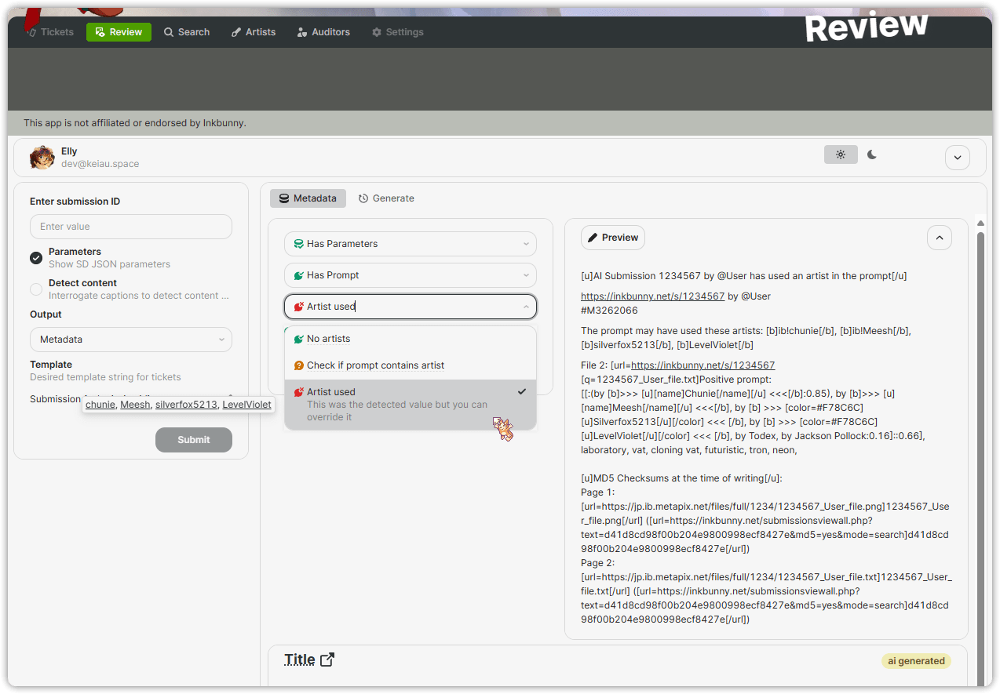

<p align="center">
  
  
  <br>
  <h1 align="center">Inkbunny Ticket Auditor</h1>
</p>

<p align="center">
  <a href="https://inkbunny.net/">
    
  </a>
  <a href="https://wiki.inkbunny.net/wiki/API">
    
  </a>
  <a href="https://pkg.go.dev/github.com/ellypaws/inkbunny/api">
    
  </a>
  <a href="https://github.com/ellypaws/inkbunny">
    
  </a>
  <a href="https://goreportcard.com/report/github.com/ellypaws/inkbunny-app">
    
  </a>
  <br>
  <a href="https://github.com/ellypaws/inkbunny-app/graphs/contributors">
    
  </a>
  <a href="https://github.com/ellypaws/inkbunny-app/commits/main">
    
  </a>
  <a href="https://github.com/ellypaws/inkbunny-app">
    
  </a>
</p>

--------------

<p align="right"><i>Disclaimer: This project is not affiliated or endorsed by Inkbunny.</i></p>


This project is designed to detect AI-generated images made with stable diffusion in Inkbunny submissions. It processes files and descriptions and uses heuristics to determine if the submission follows the [guidelines](https://wiki.inkbunny.net/wiki/ACP#AI).

By using crafted [heuristics](https://github.com/ellypaws/inkbunny-sd),
as well as the potential to use an LLM to inference the parameters.
A general purpose [API](../api) library is available to integrate with your own program logic.

## Usage

Prerequisites: Make sure you have api turned on in your Inkbunny account settings. You will need your API key and SID to
use the Inkbunny API. You can change this in
your [account settings](https://inkbunny.net/account.php#:~:text=API%20(External%20Scripting))

A demo app is available either at [https://inkbunny.keiau.space](https://inkbunny.keiau.space/app/audits) or in [retool](https://inkbunny.retool.com).


It constructs a prepared ticket based on the heuristics for you to audit and modify to then submit to Inkbunny.



There are additional features such as generating the prompt with Stable Diffusion to test if the parameters match the generation.

A caption service using [github.com/picobyte/stable-diffusion-webui-wd14-tagger](https://github.com/picobyte/stable-diffusion-webui-wd14-tagger) that can be used to generate captions for images to potentially detect humans in artwork.

Set the environment variables for the server to run. You can set the following environment variables:

There is also an [extension server](../extension) with mostly just the review service running to use with a [userscript](https://github.com/ellypaws/inkbunny-extension/tree/main/scripts) to return metadata badges or a ticket to review inside Inkbunny itself.

```bash
export PORT "your_port"
export API_HOST "your_api_host"
export SD_HOST "your_sd_host"
export REDIS_HOST "your_redis_host"
export REDIS_PASSWORD "your_redis_password"
export REDIS_USER "your_redis_user" # when not set, uses 'default'
```

An optional Redis server can be used for caching.
If not set, it will fall back to local memory cache.
You can always override this behavior for most request by setting the `Cache-Control` header to `no-cache`.

### Building from Source

Prerequisites: Make sure you have api turned on in your Inkbunny account settings. You will need your API key and SID to
use the Inkbunny API. You can change this in
your [account settings](https://inkbunny.net/account.php#:~:text=API%20(External%20Scripting))

If you're building from source, you will need to install the dependencies:
Download Go 1.22.2 or later from the [official website](https://golang.org/dl/).

```bash
git clone https://github.com/ellypaws/inkbunny-app.git
cd inkbunny-app/cmd/server

go build -o server
./server
```

You can also use the pre-built binaries from the [releases page](https://github.com/ellypaws/inkbunny-app/releases).